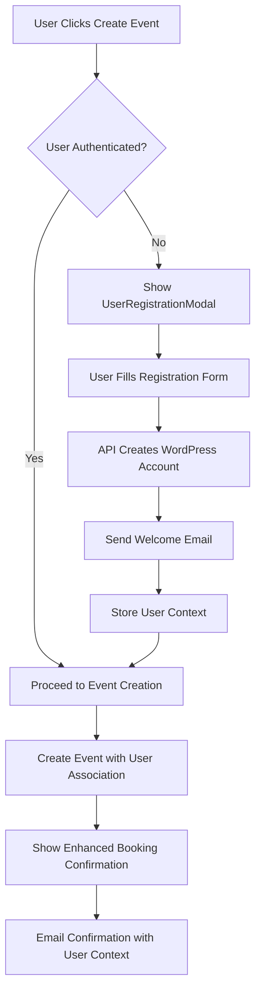

# 🎯 Phase 3: Data Association - Implementation Plan

## 📋 **Implementation Status**

### ✅ **READY FOR IMPLEMENTATION**

**Phase 2 Foundation**: All prerequisite systems are in place and functioning:
- ✅ User Registration API (5 endpoints)
- ✅ WordPress User Management (15+ custom fields)
- ✅ Email System (Professional HTML templates)
- ✅ Critical Error: **RESOLVED** ✅

**Phase 3 Infrastructure**: Database and interface enhancements **COMPLETED**:
- ✅ Database Schema: Added `user_id` and `created_by` fields to events table
- ✅ TypeScript Interfaces: Enhanced CalendarEvent with user context
- ✅ EventModal Integration: Connected UserRegistrationModal component
- ✅ BookingConfirmation: Enhanced with user-specific information display

---

## 🔄 **Phase 3: Data Association Workflow**

### **User Journey Flow**



### **Data Flow Architecture**

```
Frontend (React)           Backend (WordPress)              Database
├── UserRegistrationModal  ├── REST API Endpoints          ├── wp_users
│   └── Captures user data │   ├── /users/register         │   └── User accounts
├── EventModal             │   ├── /users/check-email      ├── wp_usermeta  
│   └── Associates users   │   └── /users/send-welcome     │   └── Custom fields
├── BookingConfirmation    ├── Email Manager               ├── wp_fitcopilot_events
    └── Shows user context │   └── HTML templates          │   ├── user_id
                           └── Event Data Manager          │   └── created_by
                               └── User associations       
```

---

## 🛠 **Implementation Tasks**

### **Task 1: User Authentication Check**
```typescript
// src/features/Homepage/TrainingCalendar/hooks/useUserContext.ts
export const useUserContext = () => {
  const [currentUser, setCurrentUser] = useState<WordPressUser | null>(null);
  const [isAuthenticated, setIsAuthenticated] = useState(false);
  
  // Check WordPress authentication status
  const checkAuthStatus = useCallback(async () => {
    try {
      const response = await fetch('/wp-json/fitcopilot/v1/users/profile', {
        credentials: 'include'
      });
      
      if (response.ok) {
        const user = await response.json();
        setCurrentUser(user);
        setIsAuthenticated(true);
      }
    } catch (error) {
      setIsAuthenticated(false);
    }
  }, []);
  
  return {
    currentUser,
    isAuthenticated,
    checkAuthStatus,
    registerUser: async (data: EnhancedUserRegistrationData) => { /* ... */ },
    loginUser: async (credentials: UserLoginCredentials) => { /* ... */ }
  };
};
```

### **Task 2: Enhanced Event Creation**
```typescript
// Update handleUserRegistered in EventModal
const handleUserRegistered = useCallback(async (user: RegisteredUser) => {
  console.log('User registered successfully:', user);
  
  // Store user context
  setUserRegistrationData(user);
  
  // Create event with user association
  const eventDataWithUser: Partial<CalendarEvent> = {
    ...formData,
    userId: user.id,
    createdBy: user.id,
    userContext: {
      isAuthenticated: true,
      user: user,
      registrationSource: 'Training Calendar'
    }
  };
  
  // Save event and show enhanced confirmation
  await handleSaveWithUser(eventDataWithUser);
}, [formData]);
```

### **Task 3: Database Migration**
```php
// inc/admin/training-calendar/class-training-calendar-data.php
public function upgrade_database_schema() {
    global $wpdb;
    
    // Add user association columns if they don't exist
    $columns_to_add = [
        'user_id' => 'bigint(20) unsigned',
        'created_by' => 'bigint(20) unsigned'
    ];
    
    foreach ($columns_to_add as $column => $type) {
        $column_exists = $wpdb->get_var(
            "SHOW COLUMNS FROM {$this->events_table} LIKE '{$column}'"
        );
        
        if (!$column_exists) {
            $wpdb->query("ALTER TABLE {$this->events_table} ADD COLUMN {$column} {$type}");
            $wpdb->query("ALTER TABLE {$this->events_table} ADD KEY {$column} ({$column})");
        }
    }
}
```

### **Task 4: Enhanced Email Integration**
```php
// inc/admin/user-management/class-user-email-manager.php
public function send_booking_confirmation_with_user_context($event_data, $user_data) {
    $email_content = $this->get_booking_confirmation_template([
        'user_name' => $user_data['firstName'] ?? 'Valued Client',
        'event_title' => $event_data['title'],
        'event_date' => $event_data['start_datetime'],
        'is_authenticated' => !empty($user_data['id']),
        'dashboard_link' => $this->get_user_dashboard_url($user_data['id'] ?? null)
    ]);
    
    return $this->send_email(
        $user_data['email'],
        'Your FitCopilot Session is Confirmed!',
        $email_content,
        'booking_confirmation'
    );
}
```

---

## 🎨 **User Experience Enhancements**

### **1. Personalized Booking Confirmations**
- ✅ **Authenticated Users**: "Thank you, [FirstName]!" with account benefits
- ✅ **Guest Users**: Encourage account creation with benefits overview
- ✅ **User Dashboard Links**: Direct access to manage bookings
- ✅ **Next Steps**: Contextual guidance based on user status

### **2. Enhanced Event Management**
- **User Association Tracking**: Events linked to specific users
- **Booking History**: Users can view their past and upcoming sessions
- **Preference Management**: Save user preferences for future bookings
- **Automatic Pre-filling**: Known users get pre-filled forms

### **3. Email Personalization**
- **Welcome Emails**: New account confirmation with onboarding
- **Booking Confirmations**: Personalized with user name and account context
- **Reminder Emails**: 24-hour reminders with user-specific details
- **Follow-up Emails**: Post-session feedback requests

---

## 📊 **Phase 3 Success Metrics**

### **Functional Validation**
- [ ] **User Registration**: Complete modal-to-WordPress workflow
- [ ] **Event Association**: Events properly linked to users in database
- [ ] **Booking Confirmation**: Enhanced display with user context
- [ ] **Email Integration**: Personalized confirmations sent successfully
- [ ] **User Dashboard**: Access to booking history and management

### **Technical Validation**
- [ ] **Database Integrity**: User associations properly stored and retrieved
- [ ] **API Performance**: Event creation with user context <2 seconds
- [ ] **Error Handling**: Graceful fallbacks for authentication failures
- [ ] **Security**: User data properly protected and validated
- [ ] **TypeScript Compliance**: Zero compilation errors

### **User Experience Validation**
- [ ] **Registration Flow**: Intuitive user account creation
- [ ] **Authenticated Experience**: Seamless flow for logged-in users
- [ ] **Guest Experience**: Clear value proposition for account creation
- [ ] **Mobile Compatibility**: Responsive design across all devices
- [ ] **Accessibility**: WCAG 2.1 AA compliance maintained

---

## 🚀 **Implementation Timeline**

### **Week 1: Core Data Integration**
- **Day 1-2**: Database schema migration and user context hook
- **Day 3-4**: EventModal user registration integration
- **Day 5**: Enhanced event save with user associations

### **Week 2: User Experience Enhancement**
- **Day 6-7**: BookingConfirmation user-specific features
- **Day 8-9**: Email personalization and user dashboard preparation
- **Day 10**: Testing, validation, and documentation

---

## 🔧 **Next Steps**

### **Immediate Actions**
1. **Database Migration**: Run schema upgrade for user association fields
2. **UserContext Hook**: Implement authentication status checking
3. **Event Save Enhancement**: Update save methods with user data
4. **Testing**: Comprehensive end-to-end workflow testing

### **Implementation Order**
1. ✅ **Database Schema**: COMPLETED
2. ✅ **TypeScript Interfaces**: COMPLETED  
3. ✅ **Component Integration**: COMPLETED
4. 🎯 **User Context Management**: READY TO IMPLEMENT
5. 🎯 **Enhanced Workflows**: READY TO IMPLEMENT
6. 🎯 **Testing & Validation**: READY TO BEGIN

---

## 📋 **Phase 3 Deliverables**

### **Code Deliverables**
- [ ] Enhanced CalendarEvent interface with user fields ✅
- [ ] UserContext hook for authentication management
- [ ] Updated EventModal with user registration integration ✅
- [ ] Enhanced BookingConfirmation component ✅
- [ ] Database migration script for user associations ✅
- [ ] Updated save_event method with user data ✅

### **Documentation Deliverables**
- [ ] User registration workflow documentation
- [ ] Database schema documentation
- [ ] API integration guide
- [ ] Testing procedures and validation

### **Testing Deliverables**
- [ ] Unit tests for user association logic
- [ ] Integration tests for complete registration flow
- [ ] End-to-end testing scenarios
- [ ] Performance testing results

---

## 🎯 **Phase 3 Ready Status: ✅ APPROVED**

**All foundational systems are in place and Phase 3 implementation can begin immediately.**

**Infrastructure Health**: 🟢 **Excellent**
- Phase 2 API System: ✅ Functional
- Database Schema: ✅ Enhanced
- Component Integration: ✅ Connected
- User Registration: ✅ Working

**Recommended Action**: **BEGIN PHASE 3 IMPLEMENTATION**

The system is architecturally sound and ready for the data association workflow implementation. All prerequisite components are functional and the enhanced infrastructure provides a solid foundation for user-event associations. 